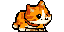
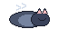

<div align="center">


<h1>
  
  Mochi
</h1>

**A tiny pixel-art companion that lives above your macOS menu bar.**
Reacts to your system. Naps when you do. Carries your downloads.

</div>

---

## Why Mochi

<table>
  <tr>
    <td width="33%" align="center" valign="top">
      <h3>Alive, not animated</h3>
      <sub>Mochi wanders with purpose, pauses to look around, sits to chill, and naps. No random twitching — natural cat-like rhythms.</sub>
    </td>
    <td width="33%" align="center" valign="top">
      <h3>Aware of your system</h3>
      <sub>Sweats when your CPU runs hot, fattens up when RAM fills, carries a sack when downloads hit. A glanceable health monitor.</sub>
    </td>
    <td width="33%" align="center" valign="top">
      <h3>Stays out of your way</h3>
      <sub>Lives above the menu bar. Optional click-through. Pin it next to your status icons. Notch-aware on M-series MacBooks.</sub>
    </td>
  </tr>
</table>

---

## Meet the Cast

<div align="center">
  <table>
    <tr>
      <td align="center">
        <br/>
        <b>Mochi</b><br/>
        <sub>the cat</sub>
      </td>
      <td align="center">
        <br/>
        <b>Goldchi</b><br/>
        <sub>the dog</sub>
      </td>
    </tr>
  </table>
  <p><sub>Switch pets anytime from settings.</sub></p>
</div>

---

## Moods & Reactions

Mochi's appearance reflects what's happening underneath. All thresholds are tunable.

<table>
  <tr>
    <td width="14%" align="center"></td>
    <td><b>Wander</b><br/><sub>Picks a destination across the menu bar and strolls to it. Default state.</sub></td>
  </tr>
  <tr>
    <td align="center"></td>
    <td><b>Look around</b><br/><sub>Tilts head after arriving somewhere — quick curiosity beat.</sub></td>
  </tr>
  <tr>
    <td align="center"></td>
    <td><b>Sit</b><br/><sub>Settles in for a moment of calm.</sub></td>
  </tr>
  <tr>
    <td align="center"></td>
    <td><b>Nap</b><br/><sub>Drifts off when nothing's going on. Wakes up refreshed.</sub></td>
  </tr>
  <tr>
    <td align="center"></td>
    <td><b>Sweat</b><br/><sub>CPU is running hot. Default trigger: <code>70%</code>.</sub></td>
  </tr>
  <tr>
    <td align="center"></td>
    <td><b>Chonk</b><br/><sub>Memory's filling up. Default trigger: <code>75%</code>.</sub></td>
  </tr>
  <tr>
    <td align="center"></td>
    <td><b>Carrying</b><br/><sub>Heavy download in progress. Default trigger: <code>2 MB/s</code>.</sub></td>
  </tr>
  <tr>
    <td align="center"></td>
    <td><b>Being petted</b><br/><sub>Hover the cursor — rolls over with floating hearts.</sub></td>
  </tr>
</table>

---

## Tricks

<table>
  <tr>
    <td width="50%" valign="top">
      <h4>Click</h4>
      <sub>Opens a native settings popover with live system stats and a quick toggle for every reaction.</sub>
    </td>
    <td valign="top">
      <h4>Right-click</h4>
      <sub>Mochi dashes for one second toward the farther edge of the screen — a quick playful sprint.</sub>
    </td>
  </tr>
  <tr>
    <td valign="top">
      <h4>Hover</h4>
      <sub>Petting mode — Mochi rolls over and three small hearts float up.</sub>
    </td>
    <td valign="top">
      <h4>Notch portal</h4>
      <sub>On M-series MacBooks, Mochi walks into a glowing portal on one side of the notch and emerges on the other.</sub>
    </td>
  </tr>
</table>

---

## Install

```bash
brew install --cask zekiahmetbayar/mochi/mochi
```

The build is ad-hoc signed, Modern macOS still flags it on first launch, so run this once to clear Gatekeeper:

```bash
xattr -dr com.apple.quarantine /Applications/Mochi.app
open -a Mochi
```

After it appears in your menu bar, click Mochi → settings popover → enable **Start at login** so it launches on every boot. No Dock icon, no helper process, no LaunchAgent — just a Login Item the system handles cleanly.

Update later with `brew upgrade --cask mochi`. Uninstall with `brew uninstall --cask mochi`.

Requires macOS 13 or newer. Universal binary — runs on both Apple Silicon and Intel Macs.

---

## Build from Source

For development:

```bash
git clone https://github.com/zekiahmetbayar/mochi.git
cd mochi
swift run Mochi
```

To produce a distributable `.app` and `.dmg` locally:

```bash
scripts/build-app.sh 0.0.0      # builds build/Mochi.app (universal, ad-hoc signed)
scripts/make-dmg.sh  0.0.0      # packages build/Mochi-0.0.0.dmg
```

The same scripts power the [`Release` GitHub Action](.github/workflows/release.yml); pushing a tag like `v1.2.3` automatically builds the DMG and publishes it to the Releases page.

---

## Settings

Click Mochi to open the popover. From there:

- **Pet** — switch between Cat and Dog
- **Size** — Small, Medium, or Large
- **Click-through overlay** — let clicks fall through to apps underneath
- **Pin to menu gap** — park Mochi next to your status icons instead of wandering
- **Start at login** — launch Mochi on boot
- **CPU sweat / RAM chonk / Heavy download** — adjust the thresholds that trigger each mood

Live readouts for CPU, RAM, and download rate sit at the top of the popover.

---

## Under the Hood

- **SwiftUI** for the menu-bar overlay and settings UI.
- **AppKit** `NSPanel` bridge for borderless, status-bar-level positioning.
- **Pure-Swift core** (`MochiCore`) for state machines, hysteresis filters, settings persistence — fully unit-tested and platform-agnostic.
- **Public Apple APIs only** for system monitoring (`host_statistics64`, `proc_pid_rusage`, `SCNetworkReachability`).
- **Notch-aware** placement via `NSScreen.auxiliaryTopLeftArea` / `auxiliaryTopRightArea`.

## Privacy

Everything stays on your Mac. No telemetry, no network calls beyond the reachability check, no analytics.

## License

[MIT](LICENSE).
